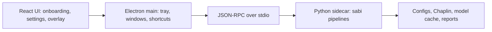

# ADR-001 - Desktop Packaging Architecture

Status: Accepted
Date: 2026-04-28

## Context

Sabi is currently a local Python PoC driven through the Typer CLI in `src/sabi/cli.py`.
The product surface is `sabi` / `python -m sabi`, with commands such as `probe`,
`silent-dictate`, `dictate`, `fused-dictate`, `download-vsr`, and eval/debug tools.

That is enough for development, but it is not enough for a user-installable desktop
product. The app needs a tray, onboarding, settings, permission guidance, global
shortcuts, update checks, and platform installers. The roadmap already recommends
Electron + React + a Python sidecar as the path of least resistance.

## Decision

Use **Electron + React (Vite) + PyInstaller Python sidecar** for the installable
desktop app.

The desktop process boundary is:

- **React renderer** owns onboarding, settings, overlay/status UI, progress display,
  and user-facing error states.
- **Electron main process** owns tray behavior, app lifecycle, global shortcuts,
  permission prompts, window creation, update checks, and Python sidecar process
  management.
- **Python sidecar** owns the ML pipeline: webcam/mic capture, lip ROI, VSR, ASR,
  fusion, cleanup, model downloads/cache, eval/debug helpers, and structured status
  events.

Electron communicates with the sidecar using **JSON-RPC over stdio**. The sidecar
protocol is versioned and wraps existing pipeline APIs rather than shelling out to
CLI commands and parsing terminal output.

## Platform Stance

Windows and macOS are first-class targets for the desktop app.

- Windows ships through an electron-builder NSIS installer.
- macOS ships through electron-builder DMG/zip artifacts with Developer ID signing
  and notarization.
- Linux is deferred to `TICKET-054` as a compatibility spike after Windows/macOS
  packaging is stable.

## Resource Root Requirement

Packaging must introduce a single runtime resource-root abstraction so development
and frozen layouts resolve assets consistently.

Current code assumes a git checkout layout in multiple places:

- `src/sabi/models/vsr/_chaplin_path.py` computes `REPO_ROOT` from the source file
  and expects `third_party/chaplin` to exist there.
- `src/sabi/input/hotkey.py` computes `REPO_ROOT` from the source file and expects
  `configs/hotkey.toml` to exist there.

Future packaging work must move these assumptions behind a runtime path helper that
can resolve:

- bundled read-only assets such as `third_party/chaplin`, default configs, prompts,
  and PyInstaller resources;
- writable user data such as downloaded model weights, cache metadata, logs, and
  reports;
- development paths when the app is launched from the repo.

The sidecar should be able to run in both modes without changing caller behavior.

## CLI Compatibility

Existing CLI commands remain supported as developer/debug tools. The desktop UI does
not call `python -m sabi silent-dictate` or parse human-readable output. It talks to
the sidecar API, while the CLI continues to call the same underlying Python pipeline
code directly.

## Rejected Alternatives

### Tauri

Tauri would reduce bundle size, but it adds Rust to the stack and makes native OS
integration work more specialized. The team and surrounding tooling are already
React/Python-oriented, so Electron is the lower-friction path.

### Fully Native Apps

Separate Swift/macOS and C#/WinUI/Windows apps would provide deep platform fit, but
they create two desktop codebases and force the team to duplicate onboarding,
settings, update, and sidecar integration logic.

### Pure Web / PWA

A browser app cannot reliably inject text into other apps, own global shortcuts, or
create/manage virtual microphone paths for meeting mode. That misses the core product
promise: dictation into arbitrary desktop apps and meeting-client integration.

### Pure PyInstaller GUI

A Python-only GUI would package the existing ML code quickly, but it would not match
the roadmap UX direction and would make tray behavior, auto-update, installer polish,
and cross-platform UI work harder than the Electron ecosystem.

## Consequences

- The repo gains a future `desktop/` app and `packaging/` build assets.
- Installers do not bundle large model weights; first launch downloads and verifies
  them into an app-owned cache.
- Code signing and notarization are required for trustworthy Windows/macOS releases.
- Hotkey ownership must be explicit: packaged desktop builds should let Electron own
  global shortcuts, while Python's `keyboard` hook remains a CLI/dev fallback.
- The Python package needs a frozen-runtime path story before PyInstaller can be
  considered production-ready.

## Follow-Up Tickets

- `TICKET-042` - Python sidecar API contract.
- `TICKET-043` - PyInstaller sidecar build.
- `TICKET-044` - Electron + Vite + React scaffold.
- `TICKET-049` - Windows installer package.
- `TICKET-050` - macOS DMG package.
- `TICKET-054` - Linux compatibility spike.

## References

- `project_roadmap.md` lines 225-310 - Packaging & Distribution section.
- `src/sabi/cli.py` - current Typer app surface.
- `src/sabi/models/vsr/_chaplin_path.py` - current Chaplin repo-root assumption.
- `src/sabi/input/hotkey.py` - current config repo-root assumption.
- `tickets/distribution_packaging/README.md` - ticket track for this decision.
