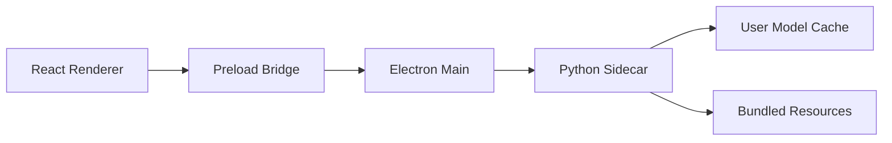
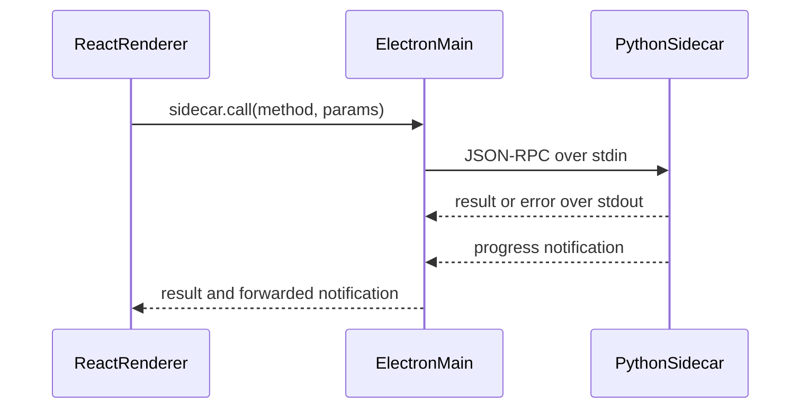
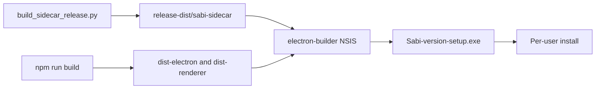

# Electron Distribution Architecture

Sabi ships as an Electron desktop shell plus a frozen Python sidecar. Electron owns
operating-system integration and app lifecycle. Python owns ML pipelines, model
cache operations, and structured runtime probes.

## Runtime Shape



## Process Responsibilities

The Electron main process creates windows, tray menu, global shortcuts, settings
storage, and sidecar lifecycle. It launches the sidecar, restarts it after unexpected
exit, and exposes a narrow IPC surface to the renderer.

The preload bridge is the only renderer-facing API. It keeps `contextIsolation`
enabled and exposes typed methods such as sidecar calls, settings updates, platform
permission helpers, and cache folder opening.

The React renderer owns user interaction: onboarding, dashboard status, model cache
controls, and settings. It does not spawn processes or read arbitrary local files.

The Python sidecar speaks JSON-RPC 2.0 over stdio. It registers handlers for
metadata, probe, cache, model setup, dictation, and eval operations. Lightweight
methods such as `meta.version` and `cache.status` avoid importing OpenCV or Torch at
startup.

## JSON-RPC Boundary

Electron sends one JSON-RPC request per line to the sidecar's stdin. The sidecar
responds with one JSON object per line on stdout. Progress events are emitted as
notifications and forwarded from the Electron main process to renderer windows.



This boundary lets the Electron app stay stable even as Python ML dependencies
change. It also gives packaging a clear surface to smoke test: `meta.version`,
`cache.status`, and later dictation-specific calls.

## Resource And Data Layout

Packaged resources are read-only and live under Electron's resources directory:

```text
resources/
  sidecar/
    sabi-sidecar/
      sabi-sidecar.exe
      _internal/
```

The Electron sidecar path resolver finds that tree through `process.resourcesPath`
in production. In development it can use the repo-local sidecar output.

Writable files never go inside the installer bundle. Model assets live in the app
cache:

```text
%LOCALAPPDATA%\Sabi\models
```

The Python cache manager reads manifests from bundled configs, downloads missing
assets on demand, verifies hashes, and reports status to the renderer.

## Build Profiles

There are two PyInstaller sidecar profiles:

- Development sidecar: `packaging/sidecar/sabi_sidecar.spec`, built by
  `python scripts/build_sidecar.py`. This profile is broad and useful for debugging,
  but it can pull CUDA-heavy Torch dependencies from the local virtual environment.
- Release sidecar: `packaging/sidecar/sabi_sidecar_release.spec`, built by
  `python scripts/build_sidecar_release.py`. This profile uses explicit hidden
  imports and excludes unused GPU/eval stacks so Windows installers stay below the
  250 MB budget.

Installer packaging always uses the release sidecar output:

```text
packaging/sidecar/release-dist/sabi-sidecar/
```

## Windows Packaging Flow



`electron-builder` reads `desktop/build/electron-builder.yml`. It bundles compiled
Electron assets, renderer assets, icons, `package.json`, and the release sidecar as
`resources/sidecar/sabi-sidecar/`. The NSIS target is per-user, avoids admin
elevation, and creates Start Menu and desktop shortcuts.

## Signing Modes

Unsigned local builds are allowed for basic packaging smoke checks. When no signing
env vars are present, `desktop/scripts/package-win.mjs` disables electron-builder
certificate auto-discovery and executable signing edits.

Self-signed local builds are for developer validation. The helper
`desktop/scripts/create-local-signing-cert.ps1` creates a CurrentUser code-signing
certificate and exports a PFX under `desktop/.certs/`. With `-Trust`, the certificate
is also trusted locally so `Get-AuthenticodeSignature` can report `Valid` on that
machine. The local self-signed mode packages without electron-builder's signing
toolchain and then signs the generated setup executable with PowerShell.

Production builds require a trusted OV/EV certificate or Azure Trusted Signing.
Those are the only acceptable paths for public distribution and SmartScreen
reputation.

## Install And First Launch

Users install `Sabi-<version>-setup.exe`. The installer writes the app under the
current user's profile, then launches the Electron app from the finish page, Start
Menu, or desktop shortcut.

On first launch, the onboarding wizard checks camera, microphone, accessibility or
input setup, and model cache state. Large model weights download after install rather
than being embedded in the installer.

## Future Distribution Work

macOS will need a DMG build, Developer ID signing, hardened runtime, entitlements,
and notarization. Linux remains a later compatibility spike with AppImage, deb, or
rpm options. Auto-update and release channels should be added only after signing and
installer QA are stable.
