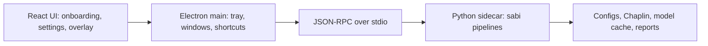

# Distribution Packaging

This directory collects docs for turning the Python CLI PoC into an installable
desktop app.

Start with `docs/adr/ADR-001-desktop-packaging.md`. It pins the packaging
architecture to **Electron + React (Vite) + PyInstaller Python sidecar**, with
Windows and macOS as first-class targets and Linux deferred to a later spike.

## Architecture

## Ticket Track

The implementation work is tracked in `tickets/distribution_packaging/`:

| Ticket | Purpose |
| --- | --- |
| `TICKET-041` | Packaging architecture ADR |
| `TICKET-042` | Python sidecar API contract |
| `TICKET-043` | PyInstaller sidecar build |
| `TICKET-044` | Electron + Vite + React scaffold |
| `TICKET-045` | Electron sidecar lifecycle + IPC bridge |
| `TICKET-046` | Tray app, global shortcuts, and window model |
| `TICKET-047` | Onboarding and permissions wizard |
| `TICKET-048` | Model asset downloader and cache manager |
| `TICKET-049` | Windows installer package |
| `TICKET-050` | macOS DMG package |
| `TICKET-051` | Auto-update and release channels |
| `TICKET-052` | Packaging CI matrix |
| `TICKET-053` | Desktop app QA and release runbook |
| `TICKET-054` | Linux compatibility spike |

## Key Rules

- Keep the existing `python -m sabi ...` CLI working for development and debugging.
- Do not bundle large model weights in installers; download and hash-verify them on
  first launch into an app-owned cache.
- Do not bundle the full ML runtime in the bootstrap installer; download and
  hash-verify the full CPU runtime pack before enabling dictation.
- Let Electron own packaged-app global shortcuts, tray behavior, update checks, and
  sidecar lifecycle.
- Let the Python sidecar own ML pipelines, model/cache operations, and structured
  status events.
- Introduce a runtime resource-root helper before relying on PyInstaller output,
  because the current code still has repo-root assumptions for `third_party/chaplin`
  and `configs/`.

## First Launch UX

The desktop app now starts with an onboarding wizard when `onboardingCompleted` is
false in the Electron settings file. The wizard walks through Welcome, Camera,
Microphone, Accessibility/Input, Models, Optional setup, and Done.

- Windows links to Camera and Microphone privacy settings when probes fail.
- macOS permission checks are routed through Electron system preference helpers, but
  final validation requires a macOS host.
- Camera and microphone steps use `probe.run` instead of self-reporting.
- Model setup calls `cache.download`; the Python sidecar owns manifest and hash
  verification while the renderer displays forwarded progress notifications.
- Optional Ollama setup is guided but external: the app detects the local
  runtime/model, opens the official Ollama installer page only after consent,
  and offers a second consent-gated `ollama pull` for the configured cleanup
  model. Virtual microphone setup remains linked, not auto-installed.

Screenshots should be captured during desktop QA once the visual copy stabilizes.

## Model Cache

Model assets are kept out of installers and downloaded into an app-owned cache:

- Windows: `%LOCALAPPDATA%\Sabi\models`
- macOS: `~/Library/Application Support/Sabi/models`
- Linux future path: `$XDG_DATA_HOME/sabi/models`

Manifest files live under `configs/manifests/` and are consumed by
`sabi.runtime.asset_cache.AssetCache`. The sidecar exposes `cache.status`,
`cache.verify`, `cache.download`, and `cache.clear`; the renderer uses those methods
to show present/missing/corrupt/unsupported state, disk usage, and one-click
re-download. `configs/vsr_weights.toml` remains supported for the legacy
`python -m sabi download-vsr` CLI flow.

## Related Docs

- `project_roadmap.md` lines 225-310 - packaging and distribution roadmap.
- `tickets/distribution_packaging/README.md` - ticket index and dependency graph.
- `docs/distribution_packaging/SIDECAR_BUILD.md` - PyInstaller sidecar build steps.
- `docs/distribution_packaging/ELECTRON_DISTRIBUTION_ARCHITECTURE.md` - Electron,
  sidecar, installer, and signing architecture.
- `docs/distribution_packaging/HOTKEY_OWNERSHIP.md` - desktop hotkey ownership.
- `docs/distribution_packaging/WINDOWS_INSTALLER.md` - Windows NSIS package flow.
- `docs/distribution_packaging/WINDOWS_SIDECAR_RUNTIME_FLOW.md` - Windows
  installer, slim sidecar, and full runtime zip activation flow.
- `docs/distribution_packaging/SIGNING_WINDOWS.md` - Windows code-signing plan.
- `docs/distribution_packaging/SIGNING_MACOS.md` - macOS signing,
  notarization, sidecar signing, and runtime-pack quarantine plan.
- `docs/INSTALL.md` - current Windows-first developer install path.
- `docs/ONBOARDING.md` - current repo onboarding for developers.
