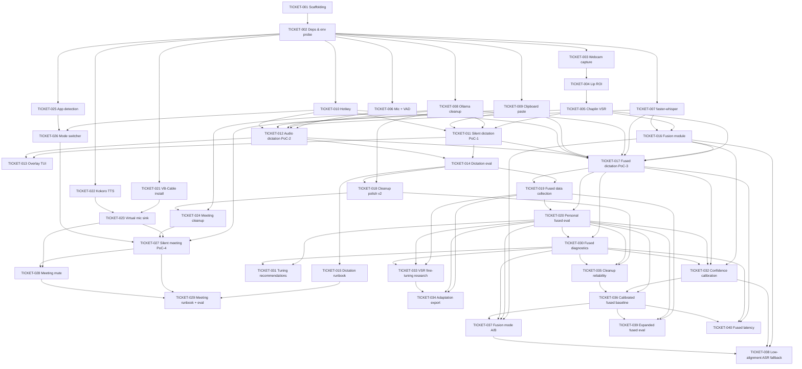

# Sabi Mouthing Speech - ML PoC Tickets

This directory is the executable breakdown of the **silent-dictation ML PoC, audio-visual fusion track, and silent-meeting mode** carved out of [`project_roadmap.md`](../project_roadmap.md). A single dev should be able to burn these tickets down and land a working end-to-end silent-dictation demo, an audio-dictation baseline, a confidence-weighted fused dictation pipeline, polished cleanup, and a silent-meeting demo that pipes a synthesized voice into Zoom / Teams / Meet.

## Scope

**In scope (this ticket set):**

- Webcam capture + MediaPipe lip ROI.
- Chaplin / Auto-AVSR silent-speech inference.
- faster-whisper ASR baseline (for A/B with the silent path and as one input to fusion).
- Audio-visual fusion module + fused dictation pipeline (roadmap Tier 2 / Phase 2).
- Ollama 3B LLM cleanup pass with a dictation prompt v1, a polished v2, and a meeting-register prompt; eval-driven prompt A/B.
- Clipboard + paste injection into the focused app (dictation output path).
- Kokoro-82M TTS via RealtimeTTS (meeting output path).
- VB-Cable virtual-mic sink routing (Windows) + bundled setup / detection.
- Push-to-talk / toggle hotkey, plus an instant meeting mute/unmute.
- Foreground-app detection (Zoom / Teams / Meet / other) and a mode switcher.
- Minimal overlay / status UI (shared across pipelines).
- Latency + WER eval harness (dictation + fusion A/B) + listening-test eval (meeting).

This realizes both **Flow 1 - Silent Dictation** (project_roadmap.md lines 58-95) and **Flow 2 - Silent Meeting** (project_roadmap.md lines 97-144), the faster-whisper audio path so we can measure the silent pipeline against a known-good baseline, and the **roadmap Phase 2** items (audio-visual fusion, project_roadmap.md lines 30-39 and 179-184; LLM cleanup polish, project_roadmap.md line 181) injected ahead of the meeting track per priority reorder.

Demo operators should start with [`../docs/DEMO.md`](../docs/DEMO.md). For a non-specialist explanation of Chaplin, faster-whisper, Ollama, WER, and the pipeline layers, read [`../docs/INFRA_CHEAT_SHEET.md`](../docs/INFRA_CHEAT_SHEET.md).

**Out of scope (deferred):**

- Voice cloning for TTS (Phase 3 roadmap item, project_roadmap.md line 188).
- Scene/screen context, gaze/gesture (roadmap lines 158-166, Phases 3+).
- Cross-platform support for the meeting sink - BlackHole (Mac) and PulseAudio (Linux) are noted in the roadmap but deferred out of PoC.
- App-aware tone routing in cleanup (Slack vs Docs vs code) - `focused_app` is plumbed but the PoC does not branch on it.

**Tracked separately:**

- Electron shell, React UI, Python sidecar, code signing, notarization, auto-update, and cross-platform installers (roadmap lines 225-310) live in the [`distribution_packaging/`](distribution_packaging/README.md) ticket track (TICKET-041 - TICKET-054). They wrap, but do not modify, the ML PoC.

## Ticket index

| ID | Title | Epic | Estimate | Depends on |
| --- | --- | --- | --- | --- |
| [TICKET-001](TICKET-001-repo-scaffolding.md) | Repo scaffolding & Python env | Infra | S | - |
| [TICKET-002](TICKET-002-core-dependencies-env-probe.md) | Core dependencies & env probe | Infra | M | 001 |
| [TICKET-003](TICKET-003-webcam-capture.md) | Webcam capture module | Capture | M | 002 |
| [TICKET-004](TICKET-004-lip-roi-detector.md) | Lip / mouth ROI detector | Capture | M | 003 |
| [TICKET-005](TICKET-005-chaplin-vsr-wrapper.md) | Chaplin / Auto-AVSR wrapper | VSR | L | 004 |
| [TICKET-006](TICKET-006-mic-capture-vad.md) | Mic capture + VAD | Capture | M | 002 |
| [TICKET-007](TICKET-007-faster-whisper-asr.md) | faster-whisper ASR baseline | ASR | M | 002 |
| [TICKET-008](TICKET-008-ollama-cleanup.md) | Ollama 3B LLM cleanup | Cleanup | M | 002 |
| [TICKET-009](TICKET-009-clipboard-paste-injection.md) | Clipboard + paste injection | Injection | S | 002 |
| [TICKET-010](TICKET-010-hotkey-trigger.md) | Hotkey / trigger layer | Injection | S | 002 |
| [TICKET-011](TICKET-011-silent-dictation-pipeline.md) | Silent-dictation pipeline (PoC-1) | Pipeline | L | 005, 008, 009, 010 |
| [TICKET-012](TICKET-012-audio-dictation-pipeline.md) | Audio-dictation pipeline (PoC-2 baseline) | Pipeline | M | 006, 007, 008, 009, 010 |
| [TICKET-013](TICKET-013-overlay-status-ui.md) | Minimal overlay / status UI | UX | M | 011, 012 |
| [TICKET-014](TICKET-014-latency-wer-eval-harness.md) | Latency + WER eval harness | Eval | L | 011, 012 |
| [TICKET-015](TICKET-015-demo-runbook.md) | Demo runbook | Eval | S | 014 |
| [TICKET-016](TICKET-016-fusion-module.md) | Audio-visual fusion module | Fusion | M | 005, 007 |
| [TICKET-017](TICKET-017-fused-dictation-pipeline.md) | Fused dictation pipeline (PoC-3) | Pipeline | L | 016, 005, 007, 008, 009, 010, 011, 012 |
| [TICKET-018](TICKET-018-cleanup-polish-prompt-v2.md) | LLM cleanup polish (prompt v2 + eval A/B) | Cleanup | M | 008, 014 |
| [TICKET-019](TICKET-019-fused-eval-dataset-collection.md) | Fused eval dataset collection tool | Eval | M | 014, 017 |
| [TICKET-020](TICKET-020-personal-fused-eval-runbook.md) | Personal fused eval runbook + baseline | Eval | S | 017, 019 |
| [TICKET-021](TICKET-021-virtual-mic-install.md) | Virtual mic install integration (VB-Cable) | Infra | S | 002 |
| [TICKET-022](TICKET-022-kokoro-tts-wrapper.md) | Kokoro TTS wrapper (RealtimeTTS streaming) | Output | L | 002 |
| [TICKET-023](TICKET-023-virtual-mic-sink.md) | Virtual mic audio sink routing | Output | M | 021, 022 |
| [TICKET-024](TICKET-024-meeting-register-cleanup.md) | Meeting-register cleanup prompt | Cleanup | S | 008, 018 |
| [TICKET-025](TICKET-025-foreground-app-detection.md) | Foreground app detection | Orchestration | S | 002 |
| [TICKET-026](TICKET-026-mode-switcher.md) | Mode switcher / orchestrator | Orchestration | M | 010, 025 |
| [TICKET-027](TICKET-027-silent-meeting-pipeline.md) | Silent-meeting pipeline (PoC-4) | Pipeline | L | 005, 023, 024, 026 |
| [TICKET-028](TICKET-028-meeting-mute-toggle.md) | Meeting mute / unmute instant toggle | Orchestration | S | 023, 027 |
| [TICKET-029](TICKET-029-meeting-demo-eval.md) | Meeting demo runbook + listening-test eval | Eval | M | 015, 027, 028 |
| [TICKET-030](TICKET-030-fused-eval-report-diagnostics.md) | Fused eval report diagnostics | Eval | M | 017, 020 |
| [TICKET-031](TICKET-031-eval-driven-fused-tuning-recommendations.md) | Eval-driven fused tuning recommendations | Eval | M | 020, 030 |
| [TICKET-032](TICKET-032-fused-confidence-calibration.md) | Fused confidence calibration | Fusion | M | 016, 017, 020, 030 |
| [TICKET-033](TICKET-033-personal-vsr-finetuning-research.md) | Personal VSR fine-tuning research spike | VSR | M | 019, 020, 030 |
| [TICKET-034](TICKET-034-personal-adaptation-dataset-export.md) | Personal adaptation dataset export | Eval | M | 019, 020, 033 |
| [TICKET-035](TICKET-035-cleanup-reliability-eval-timeouts.md) | Cleanup reliability for eval timeouts | Cleanup | S | 018, 020, 030 |
| [TICKET-036](TICKET-036-calibrated-fused-eval-baseline.md) | Calibrated fused eval baseline | Eval | S | 020, 032, 035 |
| [TICKET-037](TICKET-037-fusion-mode-ab-eval.md) | Fusion mode A/B eval | Eval | M | 016, 020, 030, 036 |
| [TICKET-038](TICKET-038-low-alignment-asr-fallback.md) | Low-alignment ASR fallback policy | Fusion | M | 016, 032, 037 |
| [TICKET-039](TICKET-039-expanded-personal-fused-eval-set.md) | Expanded personal fused eval set | Eval | M | 019, 020, 036 |
| [TICKET-040](TICKET-040-fused-latency-profile-optimization.md) | Fused latency profile + optimization | Pipeline | M | 017, 030, 036 |

### Phase 3 - Distribution & Packaging

Lives in [`distribution_packaging/`](distribution_packaging/README.md) and turns the Python CLI PoC into an installable cross-platform desktop app (Electron + React + PyInstaller Python sidecar; Windows + macOS first, Linux later). Track-level details, ordering, and dependency graph live in that folder's README.

| ID | Title | Epic | Estimate | Depends on |
| --- | --- | --- | --- | --- |
| [TICKET-041](distribution_packaging/TICKET-041-packaging-architecture-adr.md) | Packaging architecture ADR | Packaging | S | - |
| [TICKET-042](distribution_packaging/TICKET-042-python-sidecar-api-contract.md) | Python sidecar API contract | Packaging | M | 041 |
| [TICKET-043](distribution_packaging/TICKET-043-pyinstaller-sidecar-build.md) | PyInstaller sidecar build | Packaging | L | 042 |
| [TICKET-044](distribution_packaging/TICKET-044-electron-vite-react-scaffold.md) | Electron + Vite + React scaffold | Packaging | M | 041 |
| [TICKET-045](distribution_packaging/TICKET-045-electron-sidecar-lifecycle-ipc.md) | Electron sidecar lifecycle + IPC bridge | Packaging | L | 042, 043, 044 |
| [TICKET-046](distribution_packaging/TICKET-046-tray-shortcuts-window-model.md) | Tray app, global shortcuts, and window model | Packaging | M | 044, 045 |
| [TICKET-047](distribution_packaging/TICKET-047-onboarding-permissions-wizard.md) | Onboarding and permissions wizard | Packaging | M | 045, 046 |
| [TICKET-048](distribution_packaging/TICKET-048-model-asset-downloader-cache.md) | Model asset downloader and cache manager | Packaging | M | 042, 047 |
| [TICKET-049](distribution_packaging/TICKET-049-windows-installer-package.md) | Windows installer package | Packaging | L | 043, 044, 045, 046 |
| [TICKET-050](distribution_packaging/TICKET-050-macos-dmg-package.md) | macOS DMG package | Packaging | L | 043, 044, 045, 046 |
| [TICKET-051](distribution_packaging/TICKET-051-auto-update-release-channels.md) | Auto-update and release channels | Packaging | M | 049, 050 |
| [TICKET-052](distribution_packaging/TICKET-052-packaging-ci-matrix.md) | Packaging CI matrix | Packaging | M | 043, 049, 050 |
| [TICKET-053](distribution_packaging/TICKET-053-desktop-qa-release-runbook.md) | Desktop app QA and release runbook | Packaging | M | 049, 050, 051, 052 |
| [TICKET-054](distribution_packaging/TICKET-054-linux-compatibility-spike.md) | Linux compatibility spike | Packaging | M | 053 |

## Dependency graph



## Suggested burn-down order

Status legend: **D** = Done, **P** = In progress, **N** = Not started.

Week 1 - dictation PoC (largely landed):

- **Day 1-2:** 001 (D), 002 (D), 003 (D), 004 (D), 006 (D), 009 (D), 010 (D).
- **Day 3-4:** 005 (D), 007 (D), 008 (D).
- **Day 5-7:** 011 (D), 012 (D).

Week 2 - dictation polish + Phase 2 fusion + cleanup polish (current focus):

- **Day 8-9:** 013, 014, 015 (overlay TUI, eval harness, demo runbook). Closes Phase 1 milestone.
- **Day 10-11:** 016, 017 (fusion module + fused dictation pipeline). Roadmap Phase 2 deliverable.
- **Day 12:** 018 (cleanup polish v2 + eval A/B). Depends on 014; reuses the eval harness for prompt comparison.
- **Day 13:** 019, 020 (personal fused eval dataset collection + runbook/baseline). Makes the fused pipeline measurable on your own data before meeting-mode work.

Week 2.5 - personal fused diagnostics + adaptation planning:

- **Day 13.5:** 030, 031, 032 (diagnose personal fused eval, turn results into recommendations, make confidence honest).
- **Day 13.75:** 033 (research whether personal VSR fine-tuning is feasible). 034 is deferred unless a real upstream training recipe is chosen.
- **Day 13.8:** 035, 036 (fix cleanup timeout/fallback, then rerun the calibrated fused baseline).
- **Day 13.9:** 037, 038 (compare fusion modes, then adjust low-alignment fallback policy if the data supports it).
- **Day 14:** 039, 040 (expand the personal eval set and profile fused latency).

Week 3 - meeting mode (deferred behind fusion + polish):

- **Day 15:** 021, 022 (VB-Cable install docs + Kokoro TTS).
- **Day 16:** 023, 024, 025 (audio sink, meeting prompt, app detection).
- **Day 17:** 026, 028 (mode switcher + mute toggle can be built in parallel).
- **Day 18:** 027 (silent-meeting pipeline wire-up).
- **Day 19:** 029 (meeting demo runbook + listening-test eval).

Week 4 - distribution & packaging (Phase 3, see [`distribution_packaging/`](distribution_packaging/README.md)):

- **Day 20:** 041 (architecture ADR), 042 (sidecar API contract).
- **Day 21:** 043 (PyInstaller sidecar build).
- **Day 22:** 044 (Electron + Vite + React scaffold), 045 (sidecar lifecycle + IPC).
- **Day 23:** 046 (tray + shortcuts), 047 (onboarding wizard), 048 (model cache).
- **Day 24:** 049 (Windows installer), 050 (macOS DMG) in parallel.
- **Day 25:** 051 (auto-update), 052 (CI matrix), 053 (QA + release runbook), 054 (Linux spike).

## Ticket template

Every ticket file follows this shape:

```
# TICKET-XXX - <title>

Phase: 1 - ML PoC
Epic: <Infra | Capture | VSR | ASR | Cleanup | Injection | UX | Eval | Pipeline | Output | Orchestration | Fusion>
Estimate: <S | M | L>
Depends on: <TICKET-YYY, TICKET-ZZZ>
Status: Not started

## Goal
One paragraph, what "done" looks like.

## System dependencies
OS-level installs (CUDA, Ollama, VB-Cable, etc.)

## Python packages
Pinned adds to pyproject.toml / requirements.txt.

## Work
Bullet list of concrete subtasks.

## Acceptance criteria
- [ ] ...

## Out of scope
What this ticket explicitly does not do (points to later ticket).

## References
Links into project_roadmap.md line ranges and upstream repos.
```

## How to work a ticket

1. **Claim it.** Flip the `Status:` line in the ticket file from `Not started` to `In progress` and put your handle in `Owner:` (add the line if missing).
2. **Branch.** `feat/ticket-NNN-<short-slug>` off `main`.
3. **Install only what the ticket lists.** The `Python packages` section is the source of truth for what gets added to `pyproject.toml` / `requirements.txt`. Do not silently pull extras.
4. **Hit every acceptance criterion.** Each checkbox is a gate, not a nice-to-have.
5. **Log latency numbers.** Any ticket that touches a pipeline stage must append a line to `reports/latency-log.md` with: ticket id, hardware, stage, p50 ms, p95 ms, sample size.
6. **Definition of done.** Acceptance criteria checked, `scripts/probe_env.py` still passes, no new lint errors, ticket `Status:` flipped to `Done`.
7. **Out of scope is a promise.** If a ticket tempts you to fix something listed as out of scope, open a new follow-up ticket instead of widening the current one.
