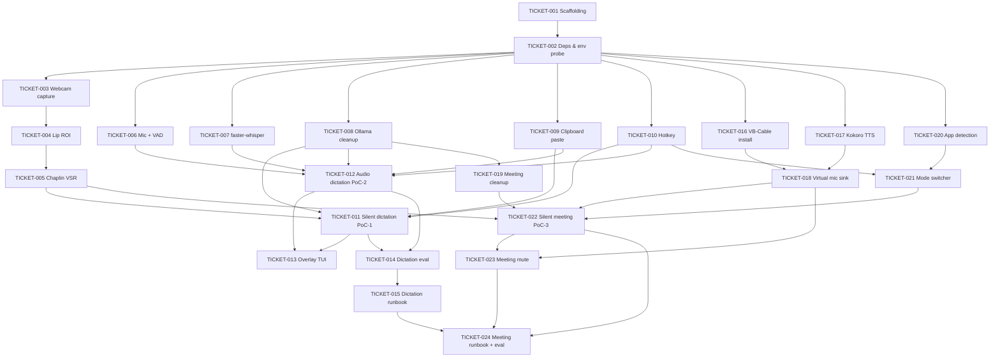

# Sabi Mouthing Speech - ML PoC Tickets

This directory is the executable breakdown of the **silent-dictation ML PoC plus silent-meeting mode** carved out of [`project_roadmap.md`](../project_roadmap.md). A single dev should be able to burn these tickets down and land a working end-to-end silent-dictation demo, an audio-dictation baseline, and a silent-meeting demo that pipes a synthesized voice into Zoom / Teams / Meet.

## Scope

**In scope (this ticket set):**

- Webcam capture + MediaPipe lip ROI.
- Chaplin / Auto-AVSR silent-speech inference.
- faster-whisper ASR baseline (for A/B with the silent path).
- Ollama 3B LLM cleanup pass with a dictation prompt and a meeting-register prompt.
- Clipboard + paste injection into the focused app (dictation output path).
- Kokoro-82M TTS via RealtimeTTS (meeting output path).
- VB-Cable virtual-mic sink routing (Windows) + bundled setup / detection.
- Push-to-talk / toggle hotkey, plus an instant meeting mute/unmute.
- Foreground-app detection (Zoom / Teams / Meet / other) and a mode switcher.
- Minimal overlay / status UI (shared across pipelines).
- Latency + WER eval harness (dictation) + listening-test eval (meeting).

This realizes both **Flow 1 - Silent Dictation** (project_roadmap.md lines 58-95) and **Flow 2 - Silent Meeting** (project_roadmap.md lines 97-144), plus the faster-whisper audio path so we can measure the silent pipeline against a known-good baseline.

**Out of scope (deferred):**

- Audio-visual fusion layer (Tier 2, roadmap lines 30-39 and 154-156).
- Voice cloning for TTS (Phase 3 roadmap item, project_roadmap.md line 188).
- Electron shell, React UI, Python sidecar packaging (roadmap lines 225-272).
- Code signing, notarization, auto-update (roadmap lines 259-277).
- Scene/screen context, gaze/gesture (roadmap lines 158-166, Phases 3+).
- Cross-platform support for the meeting sink - BlackHole (Mac) and PulseAudio (Linux) are noted in the roadmap but deferred out of PoC.

## Ticket index

| ID | Title | Epic | Estimate | Depends on |
| --- | --- | --- | --- | --- |
| [TICKET-001](TICKET-001-repo-scaffolding.md) | Repo scaffolding & Python env | Infra | S | - |
| [TICKET-002](TICKET-002-core-dependencies-env-probe.md) | Core dependencies & env probe | Infra | M | 001 |
| [TICKET-003](TICKET-003-webcam-capture.md) | Webcam capture module | Capture | M | 002 |
| [TICKET-004](TICKET-004-lip-roi-detector.md) | Lip / mouth ROI detector | Capture | M | 003 |
| [TICKET-005](TICKET-005-chaplin-vsr-wrapper.md) | Chaplin / Auto-AVSR wrapper | VSR | L | 004 |
| [TICKET-006](TICKET-006-mic-capture-vad.md) | Mic capture + VAD | Capture | M | 002 |
| [TICKET-007](TICKET-007-faster-whisper-asr.md) | faster-whisper ASR baseline | ASR | M | 002 |
| [TICKET-008](TICKET-008-ollama-cleanup.md) | Ollama 3B LLM cleanup | Cleanup | M | 002 |
| [TICKET-009](TICKET-009-clipboard-paste-injection.md) | Clipboard + paste injection | Injection | S | 002 |
| [TICKET-010](TICKET-010-hotkey-trigger.md) | Hotkey / trigger layer | Injection | S | 002 |
| [TICKET-011](TICKET-011-silent-dictation-pipeline.md) | Silent-dictation pipeline (PoC-1) | Pipeline | L | 005, 008, 009, 010 |
| [TICKET-012](TICKET-012-audio-dictation-pipeline.md) | Audio-dictation pipeline (PoC-2 baseline) | Pipeline | M | 006, 007, 008, 009, 010 |
| [TICKET-013](TICKET-013-overlay-status-ui.md) | Minimal overlay / status UI | UX | M | 011, 012 |
| [TICKET-014](TICKET-014-latency-wer-eval-harness.md) | Latency + WER eval harness | Eval | L | 011, 012 |
| [TICKET-015](TICKET-015-demo-runbook.md) | Demo runbook | Eval | S | 014 |
| [TICKET-016](TICKET-016-virtual-mic-install.md) | Virtual mic install integration (VB-Cable) | Infra | S | 002 |
| [TICKET-017](TICKET-017-kokoro-tts-wrapper.md) | Kokoro TTS wrapper (RealtimeTTS streaming) | Output | L | 002 |
| [TICKET-018](TICKET-018-virtual-mic-sink.md) | Virtual mic audio sink routing | Output | M | 016, 017 |
| [TICKET-019](TICKET-019-meeting-register-cleanup.md) | Meeting-register cleanup prompt | Cleanup | S | 008 |
| [TICKET-020](TICKET-020-foreground-app-detection.md) | Foreground app detection | Orchestration | S | 002 |
| [TICKET-021](TICKET-021-mode-switcher.md) | Mode switcher / orchestrator | Orchestration | M | 010, 020 |
| [TICKET-022](TICKET-022-silent-meeting-pipeline.md) | Silent-meeting pipeline (PoC-3) | Pipeline | L | 005, 018, 019, 021 |
| [TICKET-023](TICKET-023-meeting-mute-toggle.md) | Meeting mute / unmute instant toggle | Orchestration | S | 018, 022 |
| [TICKET-024](TICKET-024-meeting-demo-eval.md) | Meeting demo runbook + listening-test eval | Eval | M | 015, 022, 023 |

## Dependency graph



## Suggested burn-down order

Week 1 - dictation PoC:

- **Day 1-2:** 001, 002, 003, 004, 006, 009, 010 (most can run in parallel after 002 is green).
- **Day 3-4:** 005, 007, 008 (model integrations, heaviest downloads).
- **Day 5-7:** 011, 012 (the two dictation PoCs).
- **Day 8-9:** 013, 014, 015 (dictation polish, eval, runbook).

Week 2 - meeting mode:

- **Day 10:** 016, 017 (VB-Cable install docs + Kokoro TTS).
- **Day 11:** 018, 019, 020 (audio sink, meeting prompt, app detection).
- **Day 12:** 021, 023 (mode switcher + mute toggle can be built in parallel).
- **Day 13:** 022 (silent-meeting pipeline wire-up).
- **Day 14:** 024 (meeting demo runbook + listening-test eval).

## Ticket template

Every ticket file follows this shape:

```
# TICKET-XXX - <title>

Phase: 1 - ML PoC
Epic: <Infra | Capture | VSR | ASR | Cleanup | Injection | UX | Eval | Pipeline | Output | Orchestration>
Estimate: <S | M | L>
Depends on: <TICKET-YYY, TICKET-ZZZ>
Status: Not started

## Goal
One paragraph, what "done" looks like.

## System dependencies
OS-level installs (CUDA, Ollama, VB-Cable, etc.)

## Python packages
Pinned adds to pyproject.toml / requirements.txt.

## Work
Bullet list of concrete subtasks.

## Acceptance criteria
- [ ] ...

## Out of scope
What this ticket explicitly does not do (points to later ticket).

## References
Links into project_roadmap.md line ranges and upstream repos.
```

## How to work a ticket

1. **Claim it.** Flip the `Status:` line in the ticket file from `Not started` to `In progress` and put your handle in `Owner:` (add the line if missing).
2. **Branch.** `feat/ticket-NNN-<short-slug>` off `main`.
3. **Install only what the ticket lists.** The `Python packages` section is the source of truth for what gets added to `pyproject.toml` / `requirements.txt`. Do not silently pull extras.
4. **Hit every acceptance criterion.** Each checkbox is a gate, not a nice-to-have.
5. **Log latency numbers.** Any ticket that touches a pipeline stage must append a line to `reports/latency-log.md` with: ticket id, hardware, stage, p50 ms, p95 ms, sample size.
6. **Definition of done.** Acceptance criteria checked, `scripts/probe_env.py` still passes, no new lint errors, ticket `Status:` flipped to `Done`.
7. **Out of scope is a promise.** If a ticket tempts you to fix something listed as out of scope, open a new follow-up ticket instead of widening the current one.
