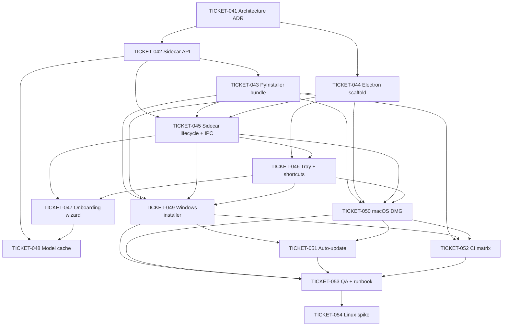

# Distribution & Packaging Tickets

This folder turns the existing Sabi Python CLI PoC into an installable cross-platform desktop app. The architecture follows [`../../project_roadmap.md`](../../project_roadmap.md) lines 225-310: **Electron + React renderer + PyInstaller-built Python sidecar**, with **Windows and macOS as first-class targets** and **Linux researched after** the first two are stable.

Tickets here are independent of the ML PoC and meeting tracks - they wrap that work, they do not modify model behavior. The existing `python -m sabi <command>` CLI keeps working as the developer/debug entry point.

## Phase

Phase 3 - Distribution & Packaging.

## Ticket index

| ID | Title | Epic | Estimate | Depends on |
| --- | --- | --- | --- | --- |
| [TICKET-041](TICKET-041-packaging-architecture-adr.md) | Packaging architecture ADR | Packaging | S | - |
| [TICKET-042](TICKET-042-python-sidecar-api-contract.md) | Python sidecar API contract | Packaging | M | 041 |
| [TICKET-043](TICKET-043-pyinstaller-sidecar-build.md) | PyInstaller sidecar build | Packaging | L | 042 |
| [TICKET-044](TICKET-044-electron-vite-react-scaffold.md) | Electron + Vite + React scaffold | Packaging | M | 041 |
| [TICKET-045](TICKET-045-electron-sidecar-lifecycle-ipc.md) | Electron sidecar lifecycle + IPC bridge | Packaging | L | 042, 043, 044 |
| [TICKET-046](TICKET-046-tray-shortcuts-window-model.md) | Tray app, global shortcuts, and window model | Packaging | M | 044, 045 |
| [TICKET-047](TICKET-047-onboarding-permissions-wizard.md) | Onboarding and permissions wizard | Packaging | M | 045, 046 |
| [TICKET-048](TICKET-048-model-asset-downloader-cache.md) | Model asset downloader and cache manager | Packaging | M | 042, 047 |
| [TICKET-049](TICKET-049-windows-installer-package.md) | Windows installer package | Packaging | L | 043, 044, 045, 046 |
| [TICKET-050](TICKET-050-macos-dmg-package.md) | macOS DMG package | Packaging | L | 043, 044, 045, 046 |
| [TICKET-051](TICKET-051-auto-update-release-channels.md) | Auto-update and release channels | Packaging | M | 049, 050 |
| [TICKET-052](TICKET-052-packaging-ci-matrix.md) | Packaging CI matrix | Packaging | M | 043, 049, 050 |
| [TICKET-053](TICKET-053-desktop-qa-release-runbook.md) | Desktop app QA and release runbook | Packaging | M | 049, 050, 051, 052 |
| [TICKET-054](TICKET-054-linux-compatibility-spike.md) | Linux compatibility spike | Packaging | M | 053 |

## Suggested order

1. **Foundations:** 041 (ADR) -> 042 (sidecar API) -> 043 (PyInstaller bundle).
2. **Shell:** 044 (Electron + React scaffold) -> 045 (sidecar lifecycle + IPC) -> 046 (tray, shortcuts, windows).
3. **First-launch UX:** 047 (onboarding) -> 048 (model cache + downloader).
4. **Distribution:** 049 (Windows installer) and 050 (macOS DMG) in parallel -> 051 (auto-update) -> 052 (CI).
5. **Operate:** 053 (QA + release runbook) -> 054 (Linux spike).

## Dependency graph

## Key decisions

- Stack: **Electron + React (Vite) + Python sidecar (PyInstaller)**. ADR-001 will pin this.
- Platforms: **Windows + macOS first**, Linux deferred to a spike (TICKET-054).
- Models: download on first launch from a hashed manifest, never bundled in the installer.
- CLI: stays as the developer/debug surface; the desktop app talks to a versioned sidecar API, not to argv.
- Hotkey ownership: **Electron owns** global shortcuts in the packaged app; the Python `keyboard` hook is a dev fallback.

## How this folder relates to the rest of the repo

- The ML PoC and meeting tracks live in [`../core_pipeline/`](../core_pipeline/), [`../meeting_feature/`](../meeting_feature/), and [`../fusion_eval_fine_tuning/`](../fusion_eval_fine_tuning/).
- This track does not change pipeline behavior; it changes how the pipelines reach end users.
- New top-level folders introduced here: `desktop/`, `packaging/`, `docs/distribution_packaging/`, `docs/adr/`.
