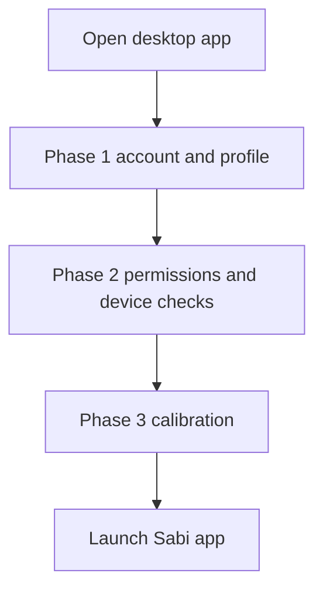
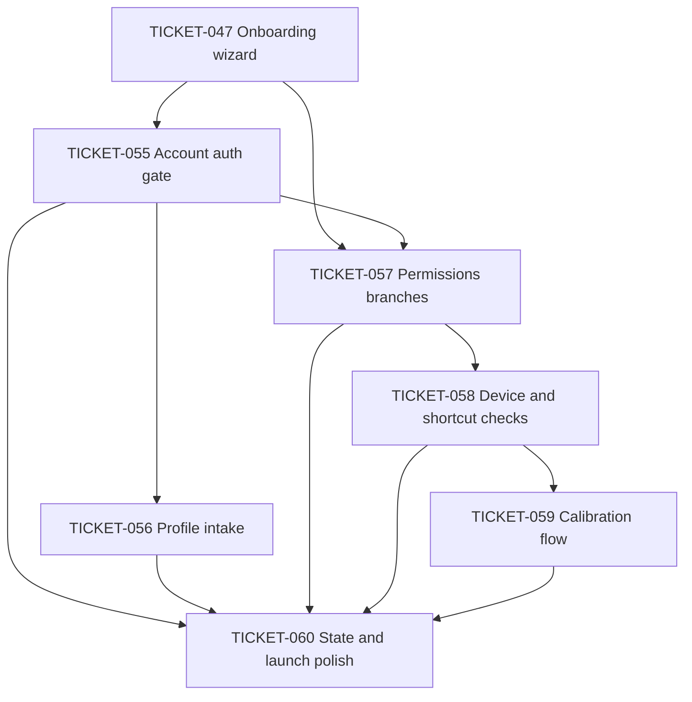

# User Interface Flow Tickets

This folder tracks the product-level desktop onboarding flow shown in the UI/UX
flow chart. It extends the completed first-launch wizard from
[`../distribution_packaging/TICKET-047-onboarding-permissions-wizard.md`](../distribution_packaging/TICKET-047-onboarding-permissions-wizard.md)
into a phase-based, account-gated onboarding path for the Electron desktop app.

The work here is UI and orchestration first: it should reuse existing renderer,
Electron bridge, sidecar, and Supabase surfaces where possible instead of
changing ML model behavior.

## Phase

Phase 4 - User Interface Flow.

## Desired onboarding flow

## Ticket index

| ID | Title | Epic | Estimate | Depends on |
| --- | --- | --- | --- | --- |
| [TICKET-055](TICKET-055-account-auth-gated-onboarding.md) | Account auth gated onboarding | UX | M | 047 |
| [TICKET-056](TICKET-056-profile-intake-questions.md) | Profile intake questions | UX | M | 055 |
| [TICKET-057](TICKET-057-permissions-branching-and-retry-ux.md) | Permissions branching and retry UX | UX | M | 047, 055 |
| [TICKET-058](TICKET-058-device-and-shortcut-checks.md) | Device and shortcut checks | UX | L | 057 |
| [TICKET-059](TICKET-059-calibration-flow.md) | Calibration flow | UX | L | 058 |
| [TICKET-060](TICKET-060-onboarding-state-and-launch-polish.md) | Onboarding state and launch polish | UX | M | 055, 056, 057, 058, 059 |

## Suggested order

1. Build the account gate first so the rest of onboarding can assume a signed-in
   session.
2. Add the profile intake screens and data contract.
3. Rework permission steps into explicit success, denial, and retry paths.
4. Add device selection and keyboard shortcut checks.
5. Add calibration capture and retry UX.
6. Finish by migrating onboarding state, updating progress UI, and tightening
   tests and docs.

## Dependency graph

## Scope boundaries

- This track owns the desktop onboarding sequence under `desktop/renderer/src/`
  and supporting Electron settings/bridge work under `desktop/electron/`.
- Supabase work must follow current Supabase Auth and RLS guidance before
  implementation. Never expose service-role keys in the renderer.
- Calibration and profile data are sensitive. Tickets must say what is stored
  locally, what is synced, and what is never uploaded.
- Pipeline quality improvements remain in the core, fusion, and meeting tracks;
  this track can call those systems but should not retune model behavior.
